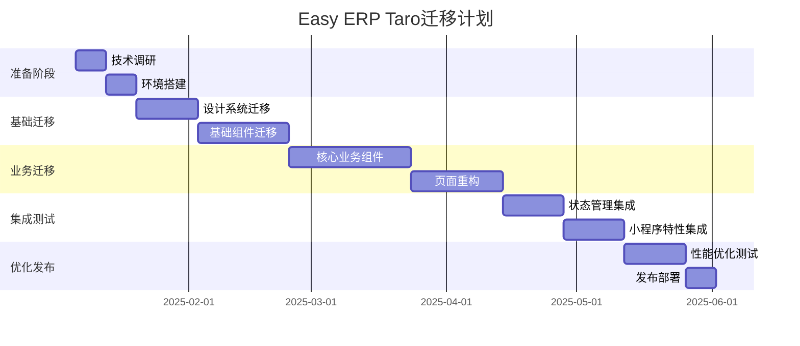

# Easy ERP 项目迁移到 Taro + NutUI 完整方案

## 迁移背景与目标

### 迁移原因
1. **跨平台需求**: 支持微信小程序、H5、App多端发布
2. **生态统一**: 使用京东NutUI提供的微信风格组件
3. **性能优化**: Taro的小程序优化和原生渲染能力
4. **维护成本**: 一套代码多端复用，降低维护成本
5. **团队技能**: 利用现有React技术栈经验

### 目标平台
- **微信小程序** (主要目标)
- **H5移动端** (次要目标)
- **支付宝小程序** (未来扩展)
- **字节跳动小程序** (未来扩展)

## 技术栈对比分析

### 当前技术栈
```
React 18 + TypeScript
├── Next.js (SSR/SSG)
├── Tailwind CSS v4
├── ShadCN UI组件库
├── Lucide React图标
└── 自定义业务组件
```

### 目标技术栈
```
Taro 3.x + TypeScript
├── React 18 (保持一致)
├── NutUI React组件库
├── Taro UI (补充组件)
├── 自定义Sass/Less样式
└── 重构业务组件
```

## 详细迁移方案

### 第一阶段：环境搭建与基础配置 (1-2周)

#### 1.1 项目初始化
```bash
# 安装Taro CLI
npm install -g @tarojs/cli

# 创建Taro项目
taro init easy-erp-taro --template react-typescript

# 安装依赖
npm install @nutui/nutui-react @nutui/icons-react
```

#### 1.2 项目结构调整
```
src/
├── app.config.ts          # 全局配置
├── app.tsx                # 应用入口
├── app.scss               # 全局样式
├── pages/                 # 页面目录
│   ├── index/            # 首页
│   ├── tasks/            # 任务页面
│   ├── workflow/         # 工作流页面
│   ├── messages/         # 消息页面
│   └── profile/          # 个人中心
├── components/            # 组件目录
│   ├── common/           # 通用组件
│   ├── business/         # 业务组件
│   └── ui/               # UI组件封装
├── services/             # API服务
├── utils/                # 工具函数
├── constants/            # 常量定义
├── types/                # 类型定义
└── stores/               # 状态管理(Zustand)
```

#### 1.3 配置文件设置
```typescript
// config/index.js
const config = {
  projectName: 'easy-erp-taro',
  date: '2025-1-4',
  designWidth: 375,
  deviceRatio: {
    640: 2.34 / 2,
    750: 1,
    828: 1.81 / 2,
    375: 2 / 1
  },
  sourceRoot: 'src',
  outputRoot: 'dist',
  plugins: ['@tarojs/plugin-html'],
  defineConstants: {},
  alias: {
    '@': path.resolve(__dirname, '..', 'src')
  },
  copy: {
    patterns: [],
    options: {}
  },
  framework: 'react',
  compiler: 'webpack5',
  mini: {
    postcss: {
      pxtransform: {
        enable: true,
        config: {
          selectorBlackList: ['nut-']
        }
      },
      url: {
        enable: true,
        config: {
          limit: 1024
        }
      },
      cssModules: {
        enable: false,
        config: {
          namingPattern: 'module',
          generateScopedName: '[name]__[local]___[hash:base64:5]'
        }
      }
    }
  },
  h5: {
    publicPath: '/',
    staticDirectory: 'static',
    postcss: {
      autoprefixer: {
        enable: true,
        config: {}
      },
      cssModules: {
        enable: false,
        config: {
          namingPattern: 'module',
          generateScopedName: '[name]__[local]___[hash:base64:5]'
        }
      }
    }
  }
}
```

### 第二阶段：设计系统迁移 (2-3周)

#### 2.1 颜色系统迁移
```scss
// styles/variables.scss
$color-primary: #07c160;          // 微信绿(保持一致)
$color-wechat-blue: #576b95;      // 微信蓝
$color-wechat-orange: #fa9d3b;    // 橙色
$color-wechat-red: #fa5151;       // 红色
$color-wechat-gray: #888888;      // 灰色

// 背景色
$color-bg-base: #f5f5f7;          // 主背景
$color-bg-card: #ffffff;          // 卡片背景
$color-bg-section: #f8fafc;       // 区块背景

// 状态色
$color-status-pending: #f59e0b;   // 待处理
$color-status-progress: #3b82f6;  // 进行中
$color-status-completed: #10b981; // 已完成
$color-status-rejected: #ef4444;  // 已拒绝

// NutUI主题定制
:root {
  --nutui-primary-color: #{$color-primary};
  --nutui-primary-color-end: #{$color-primary};
  --nutui-help-color: #{$color-wechat-gray};
  --nutui-success-color: #{$color-status-completed};
  --nutui-danger-color: #{$color-wechat-red};
  --nutui-warning-color: #{$color-wechat-orange};
}
```

#### 2.2 组件映射关系
```typescript
// 组件迁移映射表
const ComponentMapping = {
  // ShadCN UI -> NutUI React
  'Button': 'Button',
  'Input': 'Input',
  'Card': 'Card',
  'Avatar': 'Avatar',
  'Badge': 'Badge',
  'Switch': 'Switch',
  'Checkbox': 'Checkbox',
  'Radio': 'Radio',
  'Select': 'Picker',
  'Textarea': 'TextArea',
  'Progress': 'Progress',
  'Slider': 'Range',
  'Table': 'Table',
  'Tabs': 'Tabs',
  'Dialog': 'Dialog',
  'Sheet': 'Popup',
  'Toast': 'Toast',
  'Alert': 'NoticeBar',
  'Skeleton': 'Skeleton',
  'Popover': 'Popover',
  'Dropdown': 'Menu',
  
  // 特殊组件需要自定义
  'Accordion': '自定义Collapse',
  'Command': '自定义Search',
  'Calendar': 'Calendar',
  'Chart': '第三方图表库',
}
```

#### 2.3 样式系统重构
```scss
// styles/mixins.scss
@mixin wechat-card {
  background: $color-bg-card;
  border-radius: 8px;
  box-shadow: 0 1px 3px rgba(0, 0, 0, 0.1);
  padding: 16px;
}

@mixin mobile-safe-area {
  padding-top: constant(safe-area-inset-top);
  padding-top: env(safe-area-inset-top);
  padding-bottom: constant(safe-area-inset-bottom);
  padding-bottom: env(safe-area-inset-bottom);
}

@mixin touch-feedback {
  transition: all 0.2s ease;
  &:active {
    transform: scale(0.98);
    opacity: 0.8;
  }
}

// 响应式断点
@mixin mobile-xs {
  @media (max-width: 374px) { @content; }
}

@mixin mobile-sm {
  @media (min-width: 375px) and (max-width: 413px) { @content; }
}

@mixin mobile-md {
  @media (min-width: 414px) { @content; }
}
```

### 第三阶段：核心组件迁移 (3-4周)

#### 3.1 基础组件封装
```typescript
// components/ui/Button/index.tsx
import React from 'react'
import { Button as NutButton } from '@nutui/nutui-react'
import './index.scss'

interface ButtonProps {
  variant?: 'primary' | 'secondary' | 'outline' | 'ghost'
  size?: 'small' | 'normal' | 'large'
  children: React.ReactNode
  onClick?: () => void
  disabled?: boolean
  loading?: boolean
}

export const Button: React.FC<ButtonProps> = ({
  variant = 'primary',
  size = 'normal',
  children,
  ...props
}) => {
  const getType = () => {
    switch (variant) {
      case 'primary': return 'primary'
      case 'secondary': return 'default'
      case 'outline': return 'default'
      case 'ghost': return 'default'
      default: return 'primary'
    }
  }

  const getSize = () => {
    switch (size) {
      case 'small': return 'small'
      case 'large': return 'large'
      default: return 'normal'
    }
  }

  return (
    <NutButton
      type={getType()}
      size={getSize()}
      className={`custom-button custom-button--${variant}`}
      {...props}
    >
      {children}
    </NutButton>
  )
}
```

#### 3.2 布局组件重构
```typescript
// components/layout/MobileLayout/index.tsx
import React from 'react'
import Taro from '@tarojs/taro'
import { View } from '@tarojs/components'
import './index.scss'

interface MobileLayoutProps {
  children: React.ReactNode
  showHeader?: boolean
  showFooter?: boolean
  title?: string
  backgroundColor?: string
}

export const MobileLayout: React.FC<MobileLayoutProps> = ({
  children,
  showHeader = false,
  showFooter = false,
  title,
  backgroundColor = '#f5f5f7'
}) => {
  React.useEffect(() => {
    if (title) {
      Taro.setNavigationBarTitle({ title })
    }
  }, [title])

  return (
    <View 
      className="mobile-layout"
      style={{ backgroundColor }}
    >
      {showHeader && (
        <View className="mobile-layout__header">
          {/* 自定义头部 */}
        </View>
      )}
      
      <View className="mobile-layout__content">
        {children}
      </View>
      
      {showFooter && (
        <View className="mobile-layout__footer">
          {/* 自定义底部 */}
        </View>
      )}
    </View>
  )
}
```

#### 3.3 导航组件重构
```typescript
// components/navigation/BottomNavigation/index.tsx
import React from 'react'
import { Tabbar } from '@nutui/nutui-react'
import { Home, Task, Plus, Message, User } from '@nutui/icons-react'
import Taro from '@tarojs/taro'

interface BottomNavigationProps {
  activeTab: string
  onTabChange: (tab: string) => void
  messageCount?: number
}

export const BottomNavigation: React.FC<BottomNavigationProps> = ({
  activeTab,
  onTabChange,
  messageCount = 0
}) => {
  const tabs = [
    { key: 'home', title: '首页', icon: <Home /> },
    { key: 'tasks', title: '任务', icon: <Task /> },
    { key: 'create', title: '创建', icon: <Plus /> },
    { 
      key: 'messages', 
      title: '消息', 
      icon: <Message />,
      badge: messageCount > 0 ? messageCount : undefined
    },
    { key: 'profile', title: '我的', icon: <User /> }
  ]

  const handleTabClick = (index: number) => {
    const tab = tabs[index]
    onTabChange(tab.key)
    
    // Taro路由跳转
    switch (tab.key) {
      case 'home':
        Taro.switchTab({ url: '/pages/index/index' })
        break
      case 'tasks':
        Taro.switchTab({ url: '/pages/tasks/index' })
        break
      // ... 其他路由
    }
  }

  return (
    <Tabbar 
      activeColor="#07c160"
      inactiveColor="#888888"
      onSwitch={handleTabClick}
    >
      {tabs.map((tab, index) => (
        <Tabbar.Item 
          key={tab.key}
          title={tab.title}
          icon={tab.icon}
          value={tab.badge}
        />
      ))}
    </Tabbar>
  )
}
```

### 第四阶段：业务组件迁移 (4-5周)

#### 4.1 任务卡片组件
```typescript
// components/business/TaskCard/index.tsx
import React from 'react'
import { View, Text } from '@tarojs/components'
import { Card, Avatar, Tag, Progress } from '@nutui/nutui-react'
import { Task } from '@/types'
import './index.scss'

interface TaskCardProps {
  task: Task
  onTaskClick: (task: Task) => void
}

export const TaskCard: React.FC<TaskCardProps> = ({
  task,
  onTaskClick
}) => {
  const getStatusColor = (status: string) => {
    const colors = {
      pending: '#f59e0b',
      progress: '#3b82f6',
      completed: '#10b981',
      rejected: '#ef4444'
    }
    return colors[status] || '#888888'
  }

  const getStatusText = (status: string) => {
    const texts = {
      pending: '待处理',
      progress: '进行中',
      completed: '已完成',
      rejected: '已拒绝'
    }
    return texts[status] || '未知'
  }

  return (
    <Card 
      className="task-card"
      onClick={() => onTaskClick(task)}
    >
      <View className="task-card__header">
        <Text className="task-card__title">{task.title}</Text>
        <Tag 
          color={getStatusColor(task.status)}
          plain
        >
          {getStatusText(task.status)}
        </Tag>
      </View>
      
      <Text className="task-card__description">
        {task.description}
      </Text>
      
      <View className="task-card__meta">
        <View className="task-card__assignee">
          <Avatar 
            size="small" 
            src={task.assignee.avatar}
          />
          <Text className="task-card__assignee-name">
            {task.assignee.name}
          </Text>
        </View>
        
        <Text className="task-card__due-date">
          {task.dueDate}
        </Text>
      </View>
      
      {task.workflow && (
        <View className="task-card__workflow">
          <Text className="task-card__workflow-step">
            {task.workflow.stepName}
          </Text>
          <Progress 
            percentage={
              (task.workflow.currentStep / task.workflow.totalSteps) * 100
            }
            strokeColor="#07c160"
            showText={false}
            strokeWidth="4"
          />
        </View>
      )}
    </Card>
  )
}
```

#### 4.2 工作流状态组件
```typescript
// components/business/WorkflowStatus/index.tsx
import React from 'react'
import { View, Text } from '@tarojs/components'
import { Steps, Avatar } from '@nutui/nutui-react'
import { WorkflowStep } from '@/types'
import './index.scss'

interface WorkflowStatusProps {
  steps: WorkflowStep[]
  title?: string
}

export const WorkflowStatus: React.FC<WorkflowStatusProps> = ({
  steps,
  title = '工作流程'
}) => {
  const getCurrentStep = () => {
    return steps.findIndex(step => step.status === 'current')
  }

  const formatStepContent = (step: WorkflowStep) => (
    <View className="workflow-step">
      <View className="workflow-step__header">
        <Text className="workflow-step__name">{step.name}</Text>
        <Avatar 
          size="small"
          src={step.assignee.avatar}
        />
      </View>
      
      {step.completedAt && (
        <Text className="workflow-step__time">
          完成时间: {new Date(step.completedAt).toLocaleString()}
        </Text>
      )}
      
      {step.comment && (
        <Text className="workflow-step__comment">
          备注: {step.comment}
        </Text>
      )}
    </View>
  )

  return (
    <View className="workflow-status">
      {title && (
        <Text className="workflow-status__title">{title}</Text>
      )}
      
      <Steps 
        current={getCurrentStep()}
        direction="vertical"
      >
        {steps.map((step, index) => (
          <Steps.Step
            key={step.id}
            title={step.name}
            content={formatStepContent(step)}
            status={
              step.status === 'completed' ? 'finish' :
              step.status === 'current' ? 'process' : 'wait'
            }
          />
        ))}
      </Steps>
    </View>
  )
}
```

### 第五阶段：页面重构 (3-4周)

#### 5.1 首页重构
```typescript
// pages/index/index.tsx
import React, { useState, useEffect } from 'react'
import { View } from '@tarojs/components'
import Taro from '@tarojs/taro'
import { 
  WorkflowOverview,
  QuickActions,
  BottomNavigation 
} from '@/components'
import './index.scss'

const Index: React.FC = () => {
  const [stats, setStats] = useState(null)
  const [loading, setLoading] = useState(true)

  useEffect(() => {
    loadData()
  }, [])

  const loadData = async () => {
    try {
      setLoading(true)
      // 调用API获取数据
      const data = await fetchStats()
      setStats(data)
    } catch (error) {
      Taro.showToast({
        title: '加载失败',
        icon: 'error'
      })
    } finally {
      setLoading(false)
    }
  }

  const handleQuickAction = (actionId: string) => {
    switch (actionId) {
      case 'create_workflow':
        Taro.navigateTo({
          url: '/pages/workflow/create'
        })
        break
      case 'my_tasks':
        Taro.switchTab({
          url: '/pages/tasks/index'
        })
        break
      // ... 其他操作
    }
  }

  if (loading) {
    return <View className="loading">加载中...</View>
  }

  return (
    <View className="index-page">
      <WorkflowOverview stats={stats} />
      <QuickActions onActionClick={handleQuickAction} />
    </View>
  )
}

export default Index
```

#### 5.2 任务页面重构
```typescript
// pages/tasks/index.tsx
import React, { useState, useEffect } from 'react'
import { View } from '@tarojs/components'
import Taro, { useLoad, usePullDownRefresh } from '@tarojs/taro'
import { 
  TopNavigation,
  TaskCard,
  SearchBar,
  FilterPanel 
} from '@/components'
import { Task } from '@/types'
import './index.scss'

const Tasks: React.FC = () => {
  const [tasks, setTasks] = useState<Task[]>([])
  const [filteredTasks, setFilteredTasks] = useState<Task[]>([])
  const [loading, setLoading] = useState(false)
  const [hasMore, setHasMore] = useState(true)
  const [page, setPage] = useState(1)

  useLoad(() => {
    loadTasks()
  })

  usePullDownRefresh(() => {
    refreshTasks()
  })

  const loadTasks = async (pageNum = 1, isRefresh = false) => {
    try {
      setLoading(true)
      const response = await fetchTasks({
        page: pageNum,
        limit: 20
      })
      
      if (isRefresh) {
        setTasks(response.data)
        setFilteredTasks(response.data)
        setPage(1)
      } else {
        setTasks(prev => [...prev, ...response.data])
        setFilteredTasks(prev => [...prev, ...response.data])
        setPage(pageNum)
      }
      
      setHasMore(response.hasMore)
    } catch (error) {
      Taro.showToast({
        title: '加载失败',
        icon: 'error'
      })
    } finally {
      setLoading(false)
      Taro.stopPullDownRefresh()
    }
  }

  const refreshTasks = () => {
    loadTasks(1, true)
  }

  const loadMoreTasks = () => {
    if (!loading && hasMore) {
      loadTasks(page + 1)
    }
  }

  const handleTaskClick = (task: Task) => {
    Taro.navigateTo({
      url: `/pages/task-detail/index?id=${task.id}`
    })
  }

  const handleSearch = (query: string) => {
    if (!query.trim()) {
      setFilteredTasks(tasks)
      return
    }
    
    const filtered = tasks.filter(task =>
      task.title.includes(query) ||
      task.description.includes(query) ||
      task.assignee.name.includes(query)
    )
    setFilteredTasks(filtered)
  }

  return (
    <View className="tasks-page">
      <TopNavigation 
        onSearch={handleSearch}
        onFilter={() => {}}
      />
      
      <View className="tasks-list">
        {filteredTasks.map(task => (
          <TaskCard
            key={task.id}
            task={task}
            onTaskClick={handleTaskClick}
          />
        ))}
        
        {loading && (
          <View className="loading-more">加载中...</View>
        )}
        
        {!hasMore && tasks.length > 0 && (
          <View className="no-more">没有更多了</View>
        )}
        
        {filteredTasks.length === 0 && !loading && (
          <View className="empty-state">
            暂无任务数据
          </View>
        )}
      </View>
    </View>
  )
}

export default Tasks
```

### 第六阶段：状态管理与API (2-3周)

#### 6.1 状态管理 (Zustand)
```typescript
// stores/useTaskStore.ts
import { create } from 'zustand'
import { Task, TaskFilter } from '@/types'
import { taskAPI } from '@/services'

interface TaskState {
  tasks: Task[]
  filteredTasks: Task[]
  loading: boolean
  filter: TaskFilter
  
  // Actions
  loadTasks: () => Promise<void>
  searchTasks: (query: string) => void
  filterTasks: (filter: TaskFilter) => void
  updateTask: (taskId: string, updates: Partial<Task>) => void
  deleteTask: (taskId: string) => void
}

export const useTaskStore = create<TaskState>((set, get) => ({
  tasks: [],
  filteredTasks: [],
  loading: false,
  filter: {},

  loadTasks: async () => {
    set({ loading: true })
    try {
      const tasks = await taskAPI.getTasks()
      set({ tasks, filteredTasks: tasks })
    } catch (error) {
      console.error('加载任务失败:', error)
    } finally {
      set({ loading: false })
    }
  },

  searchTasks: (query: string) => {
    const { tasks } = get()
    if (!query.trim()) {
      set({ filteredTasks: tasks })
      return
    }
    
    const filtered = tasks.filter(task =>
      task.title.includes(query) ||
      task.description.includes(query)
    )
    set({ filteredTasks: filtered })
  },

  filterTasks: (filter: TaskFilter) => {
    const { tasks } = get()
    let filtered = [...tasks]
    
    if (filter.status) {
      filtered = filtered.filter(task => task.status === filter.status)
    }
    
    if (filter.priority) {
      filtered = filtered.filter(task => task.priority === filter.priority)
    }
    
    set({ filteredTasks: filtered, filter })
  },

  updateTask: (taskId: string, updates: Partial<Task>) => {
    const { tasks } = get()
    const updatedTasks = tasks.map(task =>
      task.id === taskId ? { ...task, ...updates } : task
    )
    set({ tasks: updatedTasks, filteredTasks: updatedTasks })
  },

  deleteTask: (taskId: string) => {
    const { tasks } = get()
    const filteredTasks = tasks.filter(task => task.id !== taskId)
    set({ tasks: filteredTasks, filteredTasks })
  }
}))
```

#### 6.2 API服务层
```typescript
// services/api.ts
import Taro from '@tarojs/taro'

const BASE_URL = process.env.NODE_ENV === 'development' 
  ? 'http://localhost:3000/api'
  : 'https://api.easy-erp.com'

class APIClient {
  private async request<T>(
    url: string,
    options: Taro.request.Option = {}
  ): Promise<T> {
    const token = Taro.getStorageSync('token')
    
    try {
      const response = await Taro.request({
        url: `${BASE_URL}${url}`,
        header: {
          'Content-Type': 'application/json',
          'Authorization': token ? `Bearer ${token}` : '',
          ...options.header
        },
        ...options
      })

      if (response.statusCode >= 200 && response.statusCode < 300) {
        return response.data
      } else {
        throw new Error(`HTTP ${response.statusCode}: ${response.data.message}`)
      }
    } catch (error) {
      console.error('API请求失败:', error)
      
      // 错误处理
      if (error.statusCode === 401) {
        // 清除token，跳转登录
        Taro.removeStorageSync('token')
        Taro.navigateTo({ url: '/pages/login/index' })
      }
      
      throw error
    }
  }

  get<T>(url: string, data?: any): Promise<T> {
    return this.request<T>(url, {
      method: 'GET',
      data
    })
  }

  post<T>(url: string, data?: any): Promise<T> {
    return this.request<T>(url, {
      method: 'POST',
      data
    })
  }

  put<T>(url: string, data?: any): Promise<T> {
    return this.request<T>(url, {
      method: 'PUT',
      data
    })
  }

  delete<T>(url: string): Promise<T> {
    return this.request<T>(url, {
      method: 'DELETE'
    })
  }
}

export const apiClient = new APIClient()

// 具体API服务
export const taskAPI = {
  getTasks: (params?: any) => apiClient.get('/tasks', params),
  getTask: (id: string) => apiClient.get(`/tasks/${id}`),
  createTask: (data: any) => apiClient.post('/tasks', data),
  updateTask: (id: string, data: any) => apiClient.put(`/tasks/${id}`, data),
  deleteTask: (id: string) => apiClient.delete(`/tasks/${id}`)
}

export const workflowAPI = {
  getWorkflows: () => apiClient.get('/workflows'),
  createWorkflow: (data: any) => apiClient.post('/workflows', data),
  updateWorkflow: (id: string, data: any) => apiClient.put(`/workflows/${id}`, data)
}

export const userAPI = {
  login: (credentials: any) => apiClient.post('/auth/login', credentials),
  getUserProfile: () => apiClient.get('/user/profile'),
  updateProfile: (data: any) => apiClient.put('/user/profile', data)
}
```

### 第七阶段：小程序特性集成 (2-3周)

#### 7.1 微信小程序API集成
```typescript
// utils/wechat.ts
import Taro from '@tarojs/taro'

export class WechatAPI {
  // 用户授权
  static async getUserInfo() {
    try {
      const { userInfo } = await Taro.getUserProfile({
        desc: '用于完善用户资料'
      })
      return userInfo
    } catch (error) {
      console.error('获取用户信息失败:', error)
      throw error
    }
  }

  // 登录授权
  static async login(): Promise<string> {
    try {
      const { code } = await Taro.login()
      return code
    } catch (error) {
      console.error('微信登录失败:', error)
      throw error
    }
  }

  // 分享功能
  static setupShareMenu(title: string, path: string) {
    Taro.showShareMenu({
      withShareTicket: true,
      menus: ['shareAppMessage', 'shareTimeline']
    })

    // 页面分享配置
    return {
      onShareAppMessage() {
        return {
          title,
          path,
          imageUrl: '/images/share-cover.png'
        }
      },
      
      onShareTimeline() {
        return {
          title,
          query: '',
          imageUrl: '/images/share-cover.png'
        }
      }
    }
  }

  // 扫码功能
  static async scanCode(): Promise<string> {
    try {
      const { result } = await Taro.scanCode({
        scanType: ['qrCode', 'barCode']
      })
      return result
    } catch (error) {
      console.error('扫码失败:', error)
      throw error
    }
  }

  // 选择图片
  static async chooseImage(count = 1): Promise<string[]> {
    try {
      const { tempFilePaths } = await Taro.chooseImage({
        count,
        sizeType: ['compressed'],
        sourceType: ['album', 'camera']
      })
      return tempFilePaths
    } catch (error) {
      console.error('选择图片失败:', error)
      throw error
    }
  }

  // 上传文件
  static async uploadFile(filePath: string, name: string): Promise<any> {
    try {
      const token = Taro.getStorageSync('token')
      const uploadTask = Taro.uploadFile({
        url: `${BASE_URL}/upload`,
        filePath,
        name,
        header: {
          'Authorization': `Bearer ${token}`
        }
      })

      return new Promise((resolve, reject) => {
        uploadTask.onProgressUpdate((res) => {
          console.log('上传进度:', res.progress)
        })

        uploadTask.then(resolve).catch(reject)
      })
    } catch (error) {
      console.error('上传文件失败:', error)
      throw error
    }
  }

  // 位置服务
  static async getLocation(): Promise<any> {
    try {
      const location = await Taro.getLocation({
        type: 'gcj02'
      })
      return location
    } catch (error) {
      console.error('获取位置失败:', error)
      throw error
    }
  }

  // 消息推送
  static async subscribeTmplMsg(tmplIds: string[]): Promise<any> {
    try {
      const result = await Taro.requestSubscribeMessage({
        tmplIds
      })
      return result
    } catch (error) {
      console.error('订阅消息失败:', error)
      throw error
    }
  }
}
```

#### 7.2 小程序生命周期管理
```typescript
// app.tsx
import React from 'react'
import { Provider } from 'react-redux'
import { store } from '@/stores'
import './app.scss'

class App extends React.Component {
  componentDidMount() {
    // 小程序启动时的初始化
    this.initApp()
  }

  componentDidShow() {
    // 小程序从后台进入前台时
    console.log('App Show')
    this.checkUpdate()
  }

  componentDidHide() {
    // 小程序从前台进入后台时
    console.log('App Hide')
  }

  componentDidCatchError() {
    // 错误监听
    console.log('App Error')
  }

  private async initApp() {
    try {
      // 检查登录状态
      const token = Taro.getStorageSync('token')
      if (token) {
        // 验证token有效性
        await this.validateToken(token)
      }

      // 获取系统信息
      const systemInfo = await Taro.getSystemInfo()
      console.log('系统信息:', systemInfo)

      // 设置导航栏样式
      Taro.setNavigationBarColor({
        frontColor: '#000000',
        backgroundColor: '#ffffff',
        animation: {
          duration: 400,
          timingFunc: 'easeIn'
        }
      })
    } catch (error) {
      console.error('应用初始化失败:', error)
    }
  }

  private async validateToken(token: string) {
    try {
      await userAPI.getUserProfile()
    } catch (error) {
      // Token无效，清除并跳转登录
      Taro.removeStorageSync('token')
      Taro.navigateTo({ url: '/pages/login/index' })
    }
  }

  private async checkUpdate() {
    // 检查小程序更新
    const updateManager = Taro.getUpdateManager()
    
    updateManager.onCheckForUpdate((res) => {
      console.log('是否有新版本:', res.hasUpdate)
    })

    updateManager.onUpdateReady(() => {
      Taro.showModal({
        title: '更新提示',
        content: '新版本已准备就绪，是否重启应用？',
        success: (res) => {
          if (res.confirm) {
            updateManager.applyUpdate()
          }
        }
      })
    })

    updateManager.onUpdateFailed(() => {
      console.error('新版本下载失败')
    })
  }

  render() {
    return (
      <Provider store={store}>
        {this.props.children}
      </Provider>
    )
  }
}

export default App
```

### 第八阶段：性能优化与测试 (2-3周)

#### 8.1 性能优化策略
```typescript
// utils/performance.ts
import Taro from '@tarojs/taro'

export class PerformanceOptimizer {
  // 图片懒加载
  static setupImageLazyLoad() {
    const observer = Taro.createIntersectionObserver()
    
    return {
      observe: (selector: string, callback: () => void) => {
        observer.relativeTo('.viewport').observe(selector, (res) => {
          if (res.intersectionRatio > 0) {
            callback()
            observer.unobserve(selector)
          }
        })
      },
      disconnect: () => observer.disconnect()
    }
  }

  // 列表虚拟滚动
  static createVirtualList(itemHeight: number, visibleCount: number) {
    return {
      getVisibleItems: (items: any[], scrollTop: number) => {
        const startIndex = Math.floor(scrollTop / itemHeight)
        const endIndex = Math.min(
          startIndex + visibleCount,
          items.length - 1
        )
        
        return {
          startIndex,
          endIndex,
          visibleItems: items.slice(startIndex, endIndex + 1),
          offsetY: startIndex * itemHeight
        }
      }
    }
  }

  // 请求防抖
  static debounce<T extends (...args: any[]) => void>(
    func: T,
    delay: number
  ): T {
    let timeoutId: NodeJS.Timeout
    
    return ((...args: any[]) => {
      clearTimeout(timeoutId)
      timeoutId = setTimeout(() => func.apply(null, args), delay)
    }) as T
  }

  // 数据缓存策略
  static createCache<T>(maxSize = 50, ttl = 300000) { // 5分钟TTL
    const cache = new Map<string, { data: T; timestamp: number }>()
    
    return {
      get: (key: string): T | null => {
        const item = cache.get(key)
        if (!item) return null
        
        if (Date.now() - item.timestamp > ttl) {
          cache.delete(key)
          return null
        }
        
        return item.data
      },
      
      set: (key: string, data: T): void => {
        if (cache.size >= maxSize) {
          const firstKey = cache.keys().next().value
          cache.delete(firstKey)
        }
        
        cache.set(key, { data, timestamp: Date.now() })
      },
      
      clear: (): void => cache.clear()
    }
  }

  // 内存管理
  static setupMemoryMonitor() {
    let lastMemoryUsage = 0
    
    return setInterval(() => {
      const memoryInfo = Taro.getMemoryInfo?.()
      if (memoryInfo) {
        const currentUsage = memoryInfo.usedJSHeapSize
        const growth = currentUsage - lastMemoryUsage
        
        if (growth > 10 * 1024 * 1024) { // 10MB增长
          console.warn('内存使用量增长过快:', {
            current: `${(currentUsage / 1024 / 1024).toFixed(2)}MB`,
            growth: `${(growth / 1024 / 1024).toFixed(2)}MB`
          })
        }
        
        lastMemoryUsage = currentUsage
      }
    }, 5000)
  }
}
```

#### 8.2 自动化测试
```typescript
// __tests__/components/TaskCard.test.tsx
import React from 'react'
import { render, fireEvent } from '@testing-library/react'
import { TaskCard } from '@/components/business/TaskCard'

const mockTask = {
  id: '1',
  title: '测试任务',
  description: '这是一个测试任务',
  status: 'progress',
  priority: 'high',
  assignee: {
    name: '张三',
    avatar: 'https://example.com/avatar.jpg'
  },
  dueDate: '2025-06-25',
  createdAt: '2025-06-20',
  workflow: {
    currentStep: 2,
    totalSteps: 4,
    stepName: '技术评审'
  }
}

describe('TaskCard', () => {
  test('渲染任务卡片', () => {
    const onTaskClick = jest.fn()
    const { getByText } = render(
      <TaskCard task={mockTask} onTaskClick={onTaskClick} />
    )
    
    expect(getByText('测试任务')).toBeTruthy()
    expect(getByText('这是一个测试任务')).toBeTruthy()
    expect(getByText('张三')).toBeTruthy()
  })

  test('点击事件处理', () => {
    const onTaskClick = jest.fn()
    const { getByTestId } = render(
      <TaskCard task={mockTask} onTaskClick={onTaskClick} />
    )
    
    fireEvent.click(getByTestId('task-card'))
    expect(onTaskClick).toHaveBeenCalledWith(mockTask)
  })

  test('状态显示正确', () => {
    const onTaskClick = jest.fn()
    const { getByText } = render(
      <TaskCard task={mockTask} onTaskClick={onTaskClick} />
    )
    
    expect(getByText('进行中')).toBeTruthy()
  })
})
```

## 迁移计划与时间表

### 总体时间规划 (16-20周)



### 里程碑节点

| 阶段 | 完成时间 | 主要交付物 | 验收标准 |
|------|----------|------------|----------|
| 环境搭建 | Week 2 | Taro项目初始化 | 项目可正常运行 |
| 设计系统 | Week 4 | NutUI主题配置 | 设计规范完整对齐 |
| 基础组件 | Week 7 | UI组件库迁移 | 组件功能完整 |
| 业务组件 | Week 11 | 核心业务逻辑 | 业务流程正常 |
| 页面重构 | Week 14 | 主要页面完成 | 用户体验一致 |
| 集成测试 | Week 18 | 功能集成完成 | 自动化测试通过 |
| 性能优化 | Week 20 | 优化部署完成 | 性能指标达标 |

## 风险评估与应对策略

### 技术风险

#### 1. 组件兼容性风险
- **风险**: ShadCN组件无法完全对应NutUI组件
- **应对**: 
  - 提前做组件功能对比分析
  - 准备自定义组件开发方案
  - 建立组件兼容性测试用例

#### 2. 样式迁移风险
- **风险**: Tailwind CSS无法直接在Taro中使用
- **应对**:
  - 使用Sass/Less重新实现样式系统
  - 建立样式变量映射表
  - 保持视觉效果一致性验证

#### 3. 状态管理风险
- **风险**: 复杂状态逻辑迁移困难
- **应对**:
  - 选择合适的状态管理方案(Zustand)
  - 逐步迁移，保证数据流清晰
  - 建立完整的状态测试覆盖

### 业务风险

#### 1. 功能缺失风险
- **风险**: 某些Web端功能在小程序端无法实现
- **应对**:
  - 提前调研小程序API限制
  - 准备功能替代方案
  - 与产品团队确认功能优先级

#### 2. 用户体验风险
- **风险**: 迁移后用户体验下降
- **应对**:
  - 保持原有交互模式
  - 进行用户测试验证
  - 建立用户反馈收集机制

### 项目风险

#### 1. 时间延期风险
- **风险**: 迁移工作量超出预期
- **应对**:
  - 详细的任务分解和评估
  - 留有缓冲时间
  - 建立里程碑检查机制

#### 2. 人员配置风险
- **风险**: 团队对Taro技术栈不熟悉
- **应对**:
  - 提前进行技术培训
  - 安排有经验的开发者指导
  - 建立知识文档库

## 成功标准

### 功能完整性
- [ ] 所有核心业务功能正常运行
- [ ] 用户操作流程保持一致
- [ ] 数据同步和状态管理正确

### 性能指标
- [ ] 小程序启动时间 < 3秒
- [ ] 页面切换响应时间 < 500ms
- [ ] 内存使用稳定，无明显泄漏

### 用户体验
- [ ] 界面风格保持一致
- [ ] 交互体验流畅自然
- [ ] 适配各种设备屏幕

### 技术质量
- [ ] 代码结构清晰，可维护性强
- [ ] 自动化测试覆盖率 > 80%
- [ ] 错误处理和边界情况完善

### 兼容性
- [ ] 微信小程序正常运行
- [ ] H5版本功能完整
- [ ] 支持主流移动设备

## 后续规划

### 短期优化 (3个月)
- 性能监控和优化
- 用户反馈收集和改进
- 小程序特性深度集成

### 中期扩展 (6个月)
- 支付宝小程序适配
- 字节跳动小程序适配
- 企业微信集成

### 长期演进 (12个月)
- 跨平台一体化解决方案
- 微服务架构升级
- AI功能集成

---

*本迁移方案为初步规划，具体实施时需要根据实际情况进行调整和优化。*